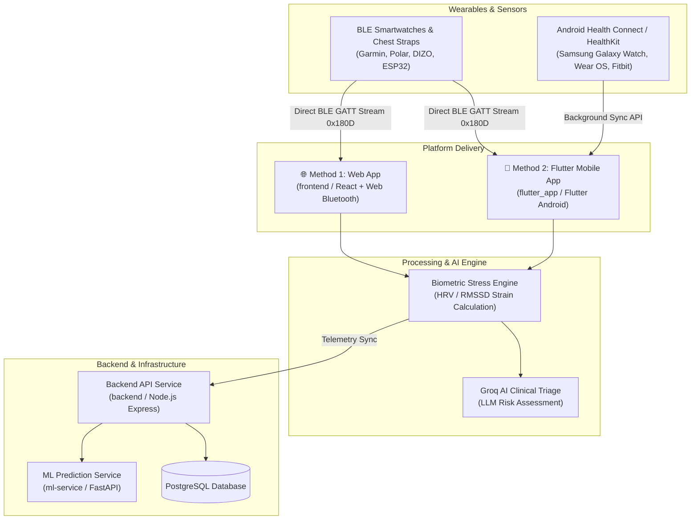

# 🛡️ NeuroRest Stress Shield

> **Real-Time Occupational Stress Monitoring, Smartwatch Biometric Telemetry & AI Clinical Risk Triage**

[](https://flutter.dev)
[](https://react.dev)
[](https://www.typescriptlang.org)
[](https://nodejs.org)
[](https://fastapi.tiangolo.com)
[](https://www.docker.com)
[](LICENSE)

---

## 📌 Overview

**NeuroRest Stress Shield** is an advanced occupational stress management system designed for high-strain shift professionals (ICU healthcare workers, emergency responders, industrial operators). The platform monitors continuous physiological stress metrics (Heart Rate, HRV / RMSSD, Galvanic Strain, Duty Cycle) and uses **Groq AI Clinical Triage** to deliver real-time risk assessments, automated shift recovery recommendations, and supervisor alerts.

The project is structured into **2 core platform delivery methods**:

1. 🌐 **Method 1: Web Application Platform** (`/frontend`) — Built with React, TypeScript, Tailwind CSS, and Web Bluetooth API.
2. 📱 **Method 2: Flutter Mobile Application** (`/flutter_app`) — Built with Flutter, supporting direct Bluetooth Low Energy (BLE) smartwatch GATT pairing and Android Health Connect / Apple HealthKit background sync.

---

## 🗂️ Monorepo Directory Architecture

```
stress-shield-project/
├── 🌐 frontend/              # Method 1: Web Application (React 18 + Vite + Tailwind CSS)
│   ├── src/
│   │   ├── components/       # UI Widgets (StressCard, DutyCycleCard, HeartRateCard, etc.)
│   │   ├── hooks/            # Custom Hooks (useAuth, useBiometricSimulator, useWebBluetooth)
│   │   ├── pages/            # Views (Dashboard, Analytics, Wellness, Medication, Profile)
│   │   └── types.ts          # TypeScript Type Definitions
│   ├── index.html
│   └── package.json
│
├── 📱 flutter_app/           # Method 2: Flutter Android & Mobile Application
│   ├── android/              # Android Native Configuration & Permissions (BLE + Health Connect)
│   ├── lib/
│   │   ├── models/           # Data Models (BiometricReading, TriageResponse, Medication)
│   │   ├── providers/        # State Management (BiometricProvider, AuthProvider, MedicationProvider)
│   │   ├── screens/          # App Views (Dashboard, BluetoothScan, Login, Profile, Medication)
│   │   ├── services/         # Hardware & API Services (BLE, HealthConnect, ApiService, GroqTriage)
│   │   └── widgets/          # Custom Flutter Widgets (TrendChart, StressCard, DutyCycleCard)
│   ├── web/                  # Flutter Web Runner Assets
│   └── pubspec.yaml          # Flutter Dependencies
│
├── ⚙️ backend/               # Core Express.js Node.js API Service
│   ├── routes/               # API Routes (Alerts, Auth, Health, Vitals)
│   ├── middleware/           # Authentication & CORS Middleware
│   └── server.js             # API Entry Point
│
├── 🧠 ml-service/            # Python FastAPI Machine Learning Stress Prediction Engine
│   ├── main.py               # FastAPI Server & Model Endpoint
│   ├── train_model.py        # ML Training Script
│   └── requirements.txt      # Python Dependencies
│
├── 🗄️ database/              # SQL Database Schemas & Local Storage
│   └── schema.sql            # PostgreSQL Database Schema
│
├── 🐳 docker-compose.yml     # Multi-Container Full-Stack Docker Orchestration
├── 📄 README.md              # Project Documentation Blueprint
└── 🛡️ LICENSE                # Open-Source MIT License
```

---

## 🏗️ System Architecture & Data Flow



---

## 🚀 Quick Start Guide

### Prerequisites
- **Node.js** v18+ & **npm**
- **Flutter SDK** v3.20+ (for Method 2 Mobile App)
- **Python** 3.10+ (for ML Service)
- **Docker** & **Docker Compose** (Optional for full-stack dockerized run)

---

### 🌐 Method 1: Running the Web Application (`/frontend`)

```bash
# 1. Navigate to the web frontend directory
cd frontend

# 2. Install dependencies
npm install

# 3. Start the Vite development server
npm run dev
```
Open **[http://localhost:5173](http://localhost:5173)** in Google Chrome to access the Web Platform with Web Bluetooth support.

---

### 📱 Method 2: Running the Flutter Mobile Application (`/flutter_app`)

```bash
# 1. Navigate to the Flutter mobile app directory
cd flutter_app

# 2. Fetch Flutter packages
flutter pub get

# 3. Analyze code quality
flutter analyze

# 4. Run on a connected Android device, emulator, or Chrome web container
flutter run
```
To run specifically on Chrome in mobile dimension: `flutter run -d chrome --web-port 3000`.

---

### ⚙️ Running Backend & ML Services

#### Option A: Using Docker Compose (Recommended)
```bash
# Spin up all services (Backend, ML Service, PostgreSQL)
docker-compose up --build
```

#### Option B: Manual Service Execution
```bash
# Terminal 1: Backend Service
cd backend
npm install
npm run dev

# Terminal 2: ML Service
cd ml-service
pip install -r requirements.txt
python main.py
```

---

## ⌚ Smart Device & Wearable Compatibility

| Device Category | Integration Method | Platform Supported | Metrics Captured |
| :--- | :--- | :--- | :--- |
| **Garmin, Polar H10, DIZO, Generic BLE Bands** | Direct BLE GATT (`0x180D`/`0x2A37`) | Web & Flutter Mobile | Live Pulse (BPM), RR-intervals (HRV) |
| **Samsung Galaxy Watch (Wear OS)** | Android Health Connect | Flutter Mobile | Resting HR, HRV SDNN, SpO2, Sleep, Steps |
| **Fitbit & Google Pixel Watch** | Android Health Connect | Flutter Mobile | Resting HR, HRV, SpO2, Active Minutes |
| **Apple Watch** | iOS HealthKit | Flutter Mobile | Heart Rate, HRV RMSSD, Sleep Stages |
| **Custom Hardware (ESP32 BLE)** | Direct BLE GATT | Web & Flutter Mobile | Custom PPG & Temperature Sensor Data |

---

## 📦 Deployment Instructions

### Web App Deployment (Vercel / Netlify)
1. Set Build Command: `npm run build` inside `/frontend`.
2. Set Output Directory: `dist`.
3. Configure Environment Variables: `VITE_GROQ_API_KEY`, `VITE_SUPABASE_URL`, `VITE_SUPABASE_ANON_KEY`.

### Flutter Android APK Build
```bash
cd flutter_app
flutter build apk --release
```
The output APK is located at: `flutter_app/build/app/outputs/flutter-apk/app-release.apk`.

---

## 🛡️ License

This project is open-source software under the [MIT License](LICENSE).
